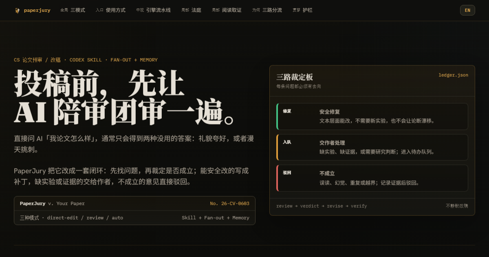

**中文** · [English](README.en.md)

<p align="center">
  
</p>

<h1 align="center">PaperJury Codex</h1>

<p align="center">真正投稿前，先让 AI reviewer 把该挑的坑挑出来。</p>

<p align="center">
  <a href="https://arxiv.org/abs/2606.16322"></a>
  <a href="https://u7079256.github.io/paperjury/overview.html?lang=zh"></a>
  <a href="https://github.com/u7079256/paperjury"></a>
  <a href="samples/dogfood/"></a>
  <a href="https://github.com/u7079256/paperjury-codex/stargazers"></a>
  <a href="https://github.com/u7079256/paperjury-codex/releases"></a>
  
</p>

<p align="center">
  <a href="https://u7079256.github.io/paperjury/overview.html?lang=zh">
    <picture>
      <source media="(prefers-color-scheme: dark)" srcset="docs/overview-card-dark.png">
      <source media="(prefers-color-scheme: light)" srcset="docs/overview-card-light.png">
      
    </picture>
  </a>
</p>

> **一句话版：** PaperJury Codex 把「帮我看看论文」变成一套可追踪的投稿前审稿流程：先找 reviewer 可能抓住的坑，再判断每条意见是否成立；能安全改的给补丁，缺实验或证据的交回作者，不成立的直接驳回。

刚写完初稿、准备投稿前自查、想改 LaTeX 但怕改漂，或者只是想先做一轮快速 triage，都可以直接用自然语言开口；不用先理解内部引擎。

> **RedNote（小红书）里程碑：** 相关分享已达到 **3 万浏览**、**1.8k 收藏**。感谢大家把 PaperJury 推荐给更多正在赶论文、改论文的人。

**PaperJury Codex 是 PaperJury 的 Codex 版。** 它把投稿前自查做成一套闭环：**审稿 → 裁定 → 修改 → 复查**。你可以让它像 reviewer 一样挑问题，也可以让它安全地改一处 LaTeX / Markdown；真正落稿前，它会先把补丁交给你确认。

它不会照单全收 AI 反馈，而是先把每条意见分成三类：

| 结果 | 含义 |
|---|---|
| **安全修复** | 表达不清、claim 过强、结构不顺这类文本层面的问题；不需要新实验，也不会让论断漂移。 |
| **作者处理** | 缺实验、缺 ablation、缺数据或证据，必须由作者判断。 |
| **不成立** | AI 评审误读了论文，或者提出了不该改的问题。 |

> [!IMPORTANT]
> PaperJury 是投稿前的自查流程，**不替代作者的科学判断，也不替代 peer review**。它不能拿来编造实验、伪造结果、加上没有证据支撑的 claim，或者掩盖论文局限。遇到需要新实验、缺失证据、作者私有知识或研究层面判断的问题，它都会交回作者处理。

## 适合谁

| 你现在的情况 | 可以直接这样用 |
|---|---|
| **刚写完初稿** | 让它像 reviewer 一样通读全文，先找最可能影响投稿的问题。 |
| **准备投稿前最后检查** | 让它检查 claim、实验支撑、格式风险和常见 desk-reject 点。 |
| **只想安全改一段话** | 直接说「把这段改紧一点，但不要改变 claim」，它会先起草补丁再等你确认。 |
| **想多轮打磨但不想盯着** | 明确授权 auto 模式，让它把安全修改落稿，高风险问题放回队列。 |

## 你会得到什么

| 输出 | 内容 |
|---|---|
| **问题台账** | 每条 reviewer-style 问题都会带证据、位置、裁定结果和当前状态；不会把一堆意见直接倒进正文。 |
| **可审阅补丁** | 只有安全修复会进入最小改动补丁；高风险改动会排队，等作者决定。 |
| **复查报告** | 能编译时真实跑 LaTeX 和格式检查；不能编译时明确降级，不假装验证过。 |
| **真实样例** | [`samples/dogfood/`](samples/dogfood/) 里有修改前后 PDF 和人工核对过的运行报告。 |

---

## 目录

- [适合谁](#适合谁)
- [你会得到什么](#你会得到什么)
- [快速上手](#快速上手)
- [能帮你做什么](#能帮你做什么)
- [三种模式](#三种模式)
- [安装](#安装)
- [Codex 版和 Claude Code 版](#codex-版和-claude-code-版)
- [真实跑一遍](#真实跑一遍)
- [深入了解](#深入了解)
- [Roadmap](#roadmap)
- [致谢](#致谢)

<details>
<summary><b>更新日志</b></summary>

> **PaperJury 论文已上 arXiv。** arXiv 页面：[*PaperJury: Due-Process Review for Bounded LaTeX Revision*](https://arxiv.org/abs/2606.16322)（arXiv:2606.16322）。论文完整介绍了「审稿 → 裁定 → 修改 → 复查」引擎。
>
> **Codex plugin 已发布。** PaperJury Codex 支持通过 Codex plugin marketplace 路线安装，同时保留 legacy clone 安装。
>
> **v1.0 release。** Codex plugin 带有非阻塞更新提醒；发现更新的稳定 tag 时，只提示，不打断当前工作。
>
> **Dogfood sample 已加入。** 仓库里有修改前后 PDF 和人工核对过的运行报告。

</details>

---

## 快速上手

先把 marketplace 加到 Codex：

```powershell
# Latest channel：安装或重新安装时使用当前 main 分支
codex marketplace add u7079256/paperjury-codex

# 稳定 pinned release：可复现的 v1.0 安装
codex marketplace add u7079256/paperjury-codex@v1.0
```

然后在 Codex plugin UI 里安装 **PaperJury Codex**。安装后可以直接在论文项目里说：

```text
审稿，重点看实验设计、claim 强度和格式风险。
```

或者：

```text
把这段 intro 改紧一些，但不要改变原来的 claim。
```

插件会暴露 `paperjury` skill，确定性 Node guards 也随插件一起安装。`node` 是必需的；LaTeX 工具链可选，有工具链时会真实编译，没有时会明确降级。

## 能帮你做什么

| 场景 | PaperJury Codex 会怎么做 |
|---|---|
| **投稿前挑问题** | 让多个领域评审通读全文，找出真正可能被 reviewer 抓住的弱点，并把致命问题和小修小补分开。 |
| **安全改 LaTeX / Markdown** | 对你指定的一处改动直接起草补丁，自检后再交给你确认；不会把一处安全修改扩成整篇重写。 |
| **复查格式风险** | 本机有 LaTeX 工具链时真实编译，检查真实报错、未定义引用、overfull box、页数和常见 desk-reject 风险；没有工具链时会明确降级。 |
| **多轮打磨** | 在明确授权的 auto 模式下，多轮运行「评审-修订-复查」闭环；安全修改自动应用，高风险改动放进队列，等你回来处理。 |

## 三种模式

| 模式 | 什么时候用 | 行为 | 人工关卡 |
|---|---|---|---|
| **direct-edit**（常用） | 你只想改一处文字、caption、LaTeX 表达或段落结构。 | 不开评审面板，直接用写作工具包起草补丁。 | 作者确认后应用。 |
| **review**（偶尔） | 你想让它审稿、挑问题、mock-review，或只审某一节 / 某条 claim。 | 启动对抗式评审引擎，先裁定问题是否成立，再进入修改。 | 每处改动逐一确认。 |
| **auto**（无人值守） | 你明确给出 Codex goal 或配置 `mode: auto`，希望它多轮跑到一个可验证目标。 | 先确认 `spine` 和评审分配，再按 bounded-aggressive + edit-safety 策略迭代。 | 前置整体授权 + 返回队列。 |

简单说：**改一处 → 直接说；想被挑刺 → 说「审稿」；想无人值守 → 给它一个 Codex goal。**

> [!WARNING]
> **auto 绝不会被自动检测，只能显式开启。** 只打开工具权限再发普通 prompt，只会跑一轮就停，不会进入多轮循环。原因见 [`codex/AGENT-GUIDE.md`](codex/AGENT-GUIDE.md)。

## 安装

### Plugin marketplace

```powershell
codex marketplace add u7079256/paperjury-codex
```

然后在 Codex plugin UI 里安装 **PaperJury Codex**。

稳定 pinned release：

```powershell
codex marketplace add u7079256/paperjury-codex@v1.0
```

每次 PaperJury workflow 开始时，插件会对 GitHub 稳定 release tag 做一次软更新检查。如果发现新版，它会给出 latest channel 和 pinned release 的安装命令；如果 GitHub 不可达，它会静默继续。设置 `PAPERJURY_DISABLE_UPDATE_CHECK=1` 可以关闭提醒。重新安装或切换 release channel 后，建议新开一个 Codex thread，让新版 skill 内容重新加载。

### Legacy skill 安装

如果当前 Codex 界面还没有 plugin 安装入口，可以 clone 成 skill：

```powershell
git clone https://github.com/u7079256/paperjury-codex "$env:USERPROFILE\.codex\skills\paperjury"
```

**给 Codex / 编码 agent：** 先读 [`codex/AGENT-GUIDE.md`](codex/AGENT-GUIDE.md) 和 [`codex/runtime.md`](codex/runtime.md)，再用 [`codex/phase-contracts.md`](codex/phase-contracts.md) 确定各阶段输入、输出、隔离和校验规则。Codex 版通过显式授权的 subagent fan-out 运行这套流程。

## Codex 版和 Claude Code 版

| 版本 | 入口 | 差异 |
|---|---|---|
| **Codex 版** | 本仓库；Codex plugin 或 `.codex/skills/` | 语义阶段由显式授权的 Codex subagents 运行；阶段契约写在 `codex/phase-contracts.md`；确定性 guards 由 orchestrator 侧经 Node 运行。 |
| **Claude Code 版** | [paperjury](https://github.com/u7079256/paperjury) | 使用 Claude Code skill / plugin 路线；语义 fan-out 由 Claude Workflow 文件驱动。 |

两个版本共享同一套方法论：bounded review、issue ledger、recall audit、edit-safety、compile guard 和 submission-readiness。Codex 版不携带也不执行 Claude Workflow 文件。

## 真实跑一遍

仓库里有一个 dogfood sample：在一篇真实草稿上跑完整多轮评审，附**修改前后 PDF** 和一份**人工核对过的运行报告**。

[`samples/dogfood/`](samples/dogfood/)（[`original_draft.pdf`](samples/dogfood/original_draft.pdf) · [`revised_draft.pdf`](samples/dogfood/revised_draft.pdf) · [运行报告](samples/dogfood/RUN_REPORT.zh-CN.md)）

如果只想确认稿件不会先被格式问题挡住，可以说：

```text
跑一下 submission-readiness / 合规检查。
```

它会做确定性格式筛查，再配合编译驱动的版面检查。

## 深入了解

新用户可以先跳过这一节。想看机制、源码结构或 agent 驱动方式，可以从这里开始：

| 你想了解 | 入口 |
|---|---|
| 真实运行效果 | [`samples/dogfood/RUN_REPORT.zh-CN.md`](samples/dogfood/RUN_REPORT.zh-CN.md) |
| Codex runtime / agent 驱动方式 | [`codex/AGENT-GUIDE.md`](codex/AGENT-GUIDE.md) · [`codex/runtime.md`](codex/runtime.md) |
| 语义阶段输入输出和隔离契约 | [`codex/phase-contracts.md`](codex/phase-contracts.md) |
| 完整协议和状态机 | [`references/review-engine-v3.md`](references/review-engine-v3.md) · [`references/ledger-schema.md`](references/ledger-schema.md) |
| 在线可视化说明 | [交互式总览](https://u7079256.github.io/paperjury/overview.html?lang=zh) |

<details>
<summary><b>展开机制、架构和项目结构说明</b></summary>

### 引擎总览

引擎把审稿流程组织成一套「庭审」：评审数量有边界，争议问题会分流审议，编辑按风险加护栏，多轮循环由确定性书记官判定是否收敛。

```text
assign-reviewers → reading-check → coverage-auditor → merge
  → { trial ‖ polish } → recall-audit → drafter
  → { edit-audit | meaning-audit } → clerk
```

### 确定性步骤

1. **读稿分解**：把手稿切成阅读单元、规范段落列表和稳定段落编号，防止问题锚点漂移。
2. **核心声明**（仅 auto 模式）：提取核心声明，获得作者确认，冻结为配置。
3. **账本**：活跃问题状态的机器可读源，跨轮次、跨会话持久化。只要没有仍在阻断 gate 的活跃 major，就视为完成；author-required 不阻断 gate，而是进入人工队列。
4. **日志**：编辑历史只追加记录，支持回滚。
5. **补丁应用**：原子性应用编辑，记录日志，支持恢复。
6. **锚点追踪**：定位已冻结的核心声明；上下文变动时，标出需要重新审计的部分。
7. **交叉引用检查**：编辑安全性预筛，检查改动关键词是否也出现在其他位置；如果出现，标记为需要语义审计。
8. **编译检查**：尝试真实 LaTeX 编译；无法编译时降级到结构检查，并明确报告不可验证。
9. **提交合规检查**：确定性的案前筛查。

### 语义步骤

1. **评审员分配**：根据论文研究方向，实例化 N 个领域评审者。
2. **完整阅读检查**：每位 holistic reviewer 通读全文一遍，列出弱点、逐字引文、总体置信度和按节覆盖报告；引不出原文，就视为没有真读。
3. **覆盖审计**：检查哪些 reviewer / section 组合可能被略读。
4. **去重**：合并重复评论，确定性导出重要性、问题类别和交叉确认。
5. **审议（trial）**：对有争议的问题开庭。先由 5 人审议，必要时升到 12 人；法官把成立的问题路由为 `valid-fixable` 或 `author-required`。
6. **润色**：快路径处理机械性问题和轻微问题；如判断错误，升级回审议。
7. **召回审计（recall）**：救回被误丢的问题，并在落稿前抽检强共识 major，防止集体误判。
8. **编辑起草**：对确认的可修复问题起草最小改动。
9. **编辑审计 / 含义审计**：检查高风险非锚改动、跨节一致性、冻结锚点和论证弧。
10. **书记官**：汇总本轮结果，合并重复项，整理残留问题，并确定性判定是否收敛。

也支持简化的 3 人评审小组，作为快速路径。

## 架构说明

- Codex 不执行 Claude Workflow 文件。语义阶段定义在 `codex/phase-contracts.md`；确定性 guards 由 orchestrator 侧经 Node 运行。
- `compile-guard.js` 对不可验证性保持诚实：无法真正编译时，降级到结构 lint，并报告 `compiled:null`。
- 提交就绪检查跨模式，分两部分：A = `compliance-check.js` + 一个语义 agent；B = 复用 `compile-guard.js` 的编译驱动版面循环，配合对 PDF 的 Read。
- 你的项目文件、ledger、journal 和 patch 都留在本地论文项目里。PaperJury 没有自己的后端或服务器，所以不会有任何东西发到 PaperJury 的服务器。审稿走的是你自己的 Codex session；模型本身仍可能跑在云端，内容到了那边怎么处理，跟随宿主环境的条款和设置，PaperJury 不会再加一层。

## 项目结构

| 路径 | 作用 |
|---|---|
| `plugins/paperjury-codex/` | Codex plugin 发布包；README、skill、运行资源和 marketplace metadata 都在这里同步。 |
| `codex/` | Codex runtime 映射、phase contracts 和 agent 驱动说明。 |
| `agents/` | Codex 侧语义 agent 定义。 |
| `scripts/` | 确定性 guards：ledger、journal、apply-patch、anchor-diff、cross-ref、compile-guard、doctor 等。 |
| `references/` | 引擎协议、ledger schema、评审者人格、写作工具和方法论。 |
| `docs/` | 交互式总览、站点资产和设计说明入口。 |
| `samples/dogfood/` | 真实草稿的 before/after PDF 和人工核对过的运行报告。 |
| `tests/` | 确定性脚本和核心状态机测试。 |

</details>

## Roadmap

- [x] **Codex plugin marketplace release。** 将 PaperJury 打包为可通过 Codex plugin marketplace 路线直接安装的版本，同时保留 legacy clone 安装。
- [x] **软更新提醒。** 启动时检查有没有更新的稳定版 tag，有就给一条非阻塞提示。
- [ ] **快速版本 / quick mode。** 一条等待更短、更省 token 的快速路径；不追求完整庭审深度，先给可用的快速 triage。
- [ ] **按不同会议 community 的 taste 调整评审人格。** CVPR、ACL、NeurIPS 的 reviewer 挑刺口味并不一样；目标是让评审更贴近各自社区的预期。
- [ ] **基于视觉的版面校验。** 编译、渲染、再检查版面，不只看编译日志。
- [ ] **从 `.cls` / 模板自动识别 venue。**
- [ ] **用更多真实论文做规模化验证。**

<details>
<summary><b>更多文件与路径</b></summary>

- 引擎协议：`references/review-engine-v3.md`
- Codex 运行时映射：`codex/runtime.md`
- Codex 语义阶段契约：`codex/phase-contracts.md`
- 自动模式：`references/auto-mode.md`
- 评审者角色、编辑工具：`references/reviewer-personas.md`、`references/writing-toolkit.md`
- 账本结构和状态：`references/ledger-schema.md`
- 提交合规：`references/submission-compliance.md`
- Codex runtime / agent 说明：`codex/AGENT-GUIDE.md`
- 脚本：`scripts/`
- Codex 运行包：`codex/`

</details>

## 致谢

spine 与防漂移设计（anchor logic-transfer audit、claim register、minimal-edit 且保义的改写策略）受 [PaperSpine](https://github.com/WUBING2023/PaperSpine) 启发。PaperSpine 是 motivation-driven 的论文起草与改写 skill，偏 forward generate/rewrite；PaperJury 借用它的 anchoring 思路，以及「可检查步骤交给确定性脚本、判断交给 model agent」这一机制，再在其上加了对抗式庭审 review 引擎。
